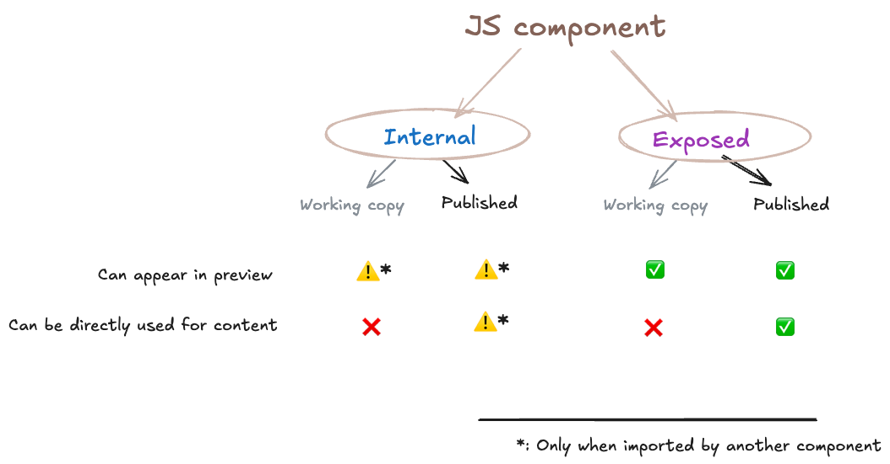

`# Drupal Canvas Config Management

In the rest of this document, `Drupal Canvas` will be written as `Canvas`.

This builds on top of the [`Canvas Components` doc](components.md). Please read that first.

It also refers to the [`Canvas Data Model` doc](data-model.md), which itself refers back to this one for a few things.
The configuration architecture is designed to serve/facilitate the data model.

**Also see the [diagram](diagrams/data-model.md).**

## Finding issues 🐛, code 🤖 & people 👯‍♀️
Related Canvas issue queue components:
- [Config management](https://www.drupal.org/project/issues/canvas?component=Config+management)

That issue queue component also has corresponding entries in [`CODEOWNERS`](../CODEOWNERS).

If anything is unclear or missing in this document, create an issue in one of those issue queue components and assign it
to one of us! 😊 🙏

## 1. Terminology

### 1.1 Existing Drupal Terminology that is crucial for Canvas

- `configuration entity dependencies`: [configuration entities may declare dependencies on modules, themes or another config entity](https://www.drupal.org/docs/drupal-apis/configuration-api/configuration-entity-dependencies)
- `configuration validation`: the ability to [thoroughly validate](https://www.drupal.org/project/drupal/issues/2164373) configuration
- `SDC`: a [Single-Directory Component](https://www.drupal.org/project/sdc)
- `Block`: a [block plugin](https://www.drupal.org/docs/drupal-apis/block-api/block-api-overview) — ⚠️ not to be confused with the identically named config entities!
- `field type`: see [`Canvas Data Model` doc](data-model.md)
- `field widget`: see [`Redux-integrated field widgets` doc](redux-integrated-field-widgets.md)
- `page template`: a Drupal theme's template in which every `theme region` is rendered
- `page.html.twig`: see `page template`
- `PageDisplayVariant`: Drupal is architected to allow multiple implementations to decorate/lay out the _main content_
  that is  computed by a route's controller. Such implementations are `PageDisplayVariant` plugins.
- `theme region`: a Drupal theme exposes multiple regions to Drupal, to render things (historically: "blocks") into; the
  surrounding markup is defined in the Drupal theme's `page.html.twig`. This is conceptually identical to
  `component slot`s.

### 1.2 Canvas terminology

- `component`: see [`Canvas Components` doc](components.md)
- `Component config entity`: `component`s available for use in Canvas are tracked as config entities. They correspond 1:1 to eligible
  `SDC`s and `Block`s.
- `component input`: see [`Canvas Components` doc](components.md)
- `Component Source Plugin`: see [`Canvas Components` doc](components.md)
- `component slot`: see [`Canvas Components` doc](components.md)
- `component type`: see [`Canvas Components` doc](components.md)
- `component tree`: see [`Canvas Data Model` doc](data-model.md)
- `content type template`: the default `component tree` for a particular `content type`, which typically includes assigning the smallest units of `structured data` to particular `component input`s, and uses `configuration entity dependencies` to ensure the necessary `component`s are present
- `Folders`: a way to organize components, patterns and code components into individual "Folders" on the client-side of Canvas
- `Folder config entity`: stores a list of `items` of particular `configEntityTypeId`, currently limited to `component`, `pattern` and `js_component`
- `PageRegion config entity`: stores a `component tree` for every `theme region` in a given Drupal theme
- `Pattern config entity`: stores a `component tree` that allows Ambitious Site Builders to save common component composition patterns for Content Creators to reuse
- `structured data`: see [`Canvas Data Model` doc](data-model.md)
- `unstructured data`: see [`Canvas Data Model` doc](data-model.md)
- `Canvas field`: see [`Canvas Data Model` doc](data-model.md)

## 2. Product requirements

This uses the terms defined above.

This adds to the product requirements listed in [`Canvas Components` doc](components.md).

(There are [more](https://docs.google.com/spreadsheets/d/1OpETAzprh6DWjpTsZG55LWgldWV_D8jNe9AM73jNaZo/edit?gid=1721130122#gid=1721130122), but these in particular affect Canvas's supported components.)

- MUST be able to synchronize `component`s and `content type template`s from one site to another WITHOUT changes to Drupal deployment best practices (requirement [`14. Configuration management`](https://docs.google.com/spreadsheets/d/1OpETAzprh6DWjpTsZG55LWgldWV_D8jNe9AM73jNaZo/edit?gid=1721130122#gid=1721130122&range=B25))
- MUST be able to populate a `theme`'s `page template` using Canvas `component`s (requirement [`19. Modify the page template`](https://docs.google.com/spreadsheets/d/1OpETAzprh6DWjpTsZG55LWgldWV_D8jNe9AM73jNaZo/edit?gid=1721130122#gid=1721130122&range=B30))
- MUST be able to store and reuse `component` compositions (requirement [`29. Layout Patterns`](https://docs.google.com/spreadsheets/d/1OpETAzprh6DWjpTsZG55LWgldWV_D8jNe9AM73jNaZo/edit?gid=1721130122#gid=1721130122&range=B41))
- MUST support auditability, assuming (to answer questions such as: which `field type` and `field widget` does a `component` use when it is instantiated, why is a given `SDC` not available as a `component` in Canvas, et cetera)

## 3. Implementation

This uses the terms defined above.

An HTTP API is provided to list, read, create, update and delete _some_ of these config entities. While this HTTP API is
primarily designed to be used by Canvas's (client-side) UI, some endpoints are marked as external, indicating they are suitable
for use by external applications.

This covers only config entities that are explicitly excluded from auto-saving/workspaces — for those entities, Canvas's
"Publish all" functionality is used; separate HTTP requests per entity in a set of changes must be avoided for both UX
and data consistency reasons.

Canvas intentionally does not use Drupal core's [JSON:API module](https://jsonapi.org/), because:
-  requiring the Drupal JSON:API module to be installed is excessive
-  Canvas's HTTP API does not need pagination support
-  Canvas tracks all available Components as config entities, but those actually do not need to be exposed in full; there's
   no need to modify them from the  client-side UI, and there already is `Component::normalizeForClientSide()` which
   enriches it with additional metadata, matching the UI's needs
- Canvas's HTTP API does not need to surface relationships between Canvas's config entities — that mostly makes sense for
  _content entity_ relationships (i.e. "entity references")

See the `canvas.api.config.*` routes.

Some of these routes are treated with the `canvas_external_api: true` route option to indicate they can be used by third-party
applications, too. The Canvas OAuth module, an optional submodule of Canvas, provides OAuth2 authentication for these routes.
(See [`canvas_oauth/README.md`](../modules/canvas_oauth/README.md) for more info.)

### 3.1 `Component config entity`

See:
- `\Drupal\canvas\Entity\Component`
- `\Drupal\canvas\ComponentSource\ComponentSourceDiscoveryInterface`
- `\Drupal\canvas\ComponentSource\ComponentSourceInterface`
- `\Drupal\canvas\ComponentSource\ComponentInstanceUpdaterInterface`

One `Component config entity` is [automatically created (and updated](https://www.drupal.org/project/canvas/issues/3463999)
per `component` that is present and meets the criteria (see [`Canvas Components` doc, section 3.1.1](components.md#3.1.1)).

When a `component` does not meet the criteria, the _reasons_ for that are tracked and presented in the UI.

The `Component` config entity contains:
- the `component` ID, with the prefix (the first ID part) identifying the `Component Source Plugin`, and the
  remainder being used by that plugin (typically to allow a `Component Source Plugin` to provide >1 `component`)
- the `source`: a `Component Source Plugin` ID.
- the `source_local_id`: The intra-source ID of this component in this source — can be a plugin ID (e.g. for `Block` and
  `SDC`), a config entity ID (e.g. for `js`), or anything else, such as a URL to identify a remotely discoverable
  `component` if such a `Component Source Plugin` existed
- the (versioned) `settings`: each `Component Source Plugin` MAY need to store component settings, and each has different needs:
  - `SDC` component type: `prop_field_definitions`, to configure what field type, widget and so on to use to store and
     edit the SDC's props.
  - `Block` component type: `default_settings`, to store the default block plugin settings, if any. For example: hide
     the site slogan whenever the "site branding" block is placed. Not to be confused with the settings specified per
     `component instance`, which override those defaults.
- the `status`: `true` conveys it is available for Canvas Content Creators, `false` conveys it once was available, but not
  anymore (either because it was explicitly disabled by the Site Builder, or because the underlying SDC was marked as
  "obsolete"). Existing content can then continue to use disabled `Component`s (in other words: nothing breaks), while
  new content must use the most current Site Builder-curated list of `Component`s.
- which `field type` and `field widget` must be used to populate it with `unstructured data` — for algorithmic details,
 see [`Canvas Data model`, section 3.1: "from Front-End Developer to a Canvas data model that empowers the Content Creator](./data-model.md#3.1)
- the (versioned) `fallback_metadata`: when the `Component Source Plugin` can no longer find the `component` because a dependency is
  removed (e.g. the module providing an SDC is uninstalled or a `JavaScriptComponent` config entity is deleted), this
  metadata (currently only slot definitions) will be used to fall back to the special `fallback` source to ensure
  existing `component tree`s continue to work (see [`Canvas Components` doc, section 3.4](components.md#3.4))
- `config entity dependencies` on the modules providing the `field type` and `field widget`

These config entities are therefore the foundations that enable Canvas to work reliably, and allow:
- auditing (listing which components are available to Canvas and reasons why components are unavailable, tracking changes in
  computed `field type` and `field widget` for a `component input` thanks to those being stored in _versioned_
  `settings` — see [`Canvas Data model`, section 3.1.2.b](./data-model#3.1.2.b))
- dependency-checking (this config entity's dependencies on other modules, as well as other config entities depending on
  this config entity, but also ensuring the necessary code is present, such as `field type` and `field widget` plugins)
- exporting, importing, synchronizing from one environment or site to another
- validating: the ability to be 100% confident that all dependencies are satisfied, and all criteria are still met (see
  [`Canvas Components` doc, section 3.1.1](components.md#3.1.1)).

UI routes:
- available `component`s: `/admin/appearance/component`
- unavailable `component`s: `/admin/appearance/component/status`

### 3.2 `JavaScriptComponent config entity`

See:
- `\Drupal\canvas\Entity\JavaScriptComponent`
- `\Drupal\canvas\Plugin\Canvas\ComponentSource\JsComponent`
- `\Drupal\canvas\Plugin\Validation\Constraint\JsComponentHasValidAndSupportedSdcMetadataConstraintValidator`
- `\Drupal\canvas\Plugin\Validation\Constraint\IsStorablePropShapeConstraintValidator`
- `type: canvas.js_component.*`
- `type: canvas.json_schema.prop.*`

A `JavaScriptComponent config entity` (UI label: _code components_) can be created by Ambitious Site Builders to create
so-called components in the browser, without the need for learning how to create `SDC`s, and most importantly: without
the need for deploying new or updated modules or themes.

The intent is to make it as easy and frictionless as possible to create such _code components_, while also ensuring that
they can easily be synced from one Drupal instance (_environment_) to another (per requirement
[`14. Configuration management`](https://docs.google.com/spreadsheets/d/1OpETAzprh6DWjpTsZG55LWgldWV_D8jNe9AM73jNaZo/edit?gid=1721130122#gid=1721130122&range=B25)).

Of course, such in-browser created _code components_ must also be able to accept inputs. Rather than reinventing the
wheel, the same _schema_ for defining explicit inputs as that of `SDC` is adopted here. But to be able to guarantee that
for every valid `JavaScript Component config entity` a working auto-generated input UX can be guaranteed, additional
restrictions are applied during validation:
- Not all JSON Schema "types" and "formats" are allowed; only ones that Canvas can generate an input UX for. That means it
  must have a "storable `prop shape`". See [`section 3.1.2.b in Canvas Shape Matching into Field Types`
  doc](shape-matching-into-field-types.md). The `IsStorablePropShapeConstraint` validation constraint checks this. It
  ensures a good UX for the in-browser _code component_ editor.
- Fascinatingly, to make these config entities comply with `SDC`'s schema, we must express the _supported subset_ of
  JSON Schema (supported at all by `SDC`, and then supported by `Canvas` for the generated input UX) in Drupal's _config
  schema_! This ensures a good DX for those modifying (exported) configuration by hand.
  See `config/schema/canvas.json_schema.yml`.

Once a _code component_ is considered ready for use by its creator, it can be exposed as a Canvas `component` (which under
the hood involves creating a sibling `Component config entity` — see [section 3.1](#3.1) above). This is made possible
by the `JS` `Component Source Plugin`. Section `3.2.1` below describes this in detail.

To the Content Creator, then, the input UX of an `SDC`-sourced `component` and a `JS`-sourced `component` with the same
"props" (the name used for the `explicit component input` of both of those `Component Source Plugin`s) must be
_indistinguishable_ from each other — despite one relying on Twig and the other only on JS.

#### 3.2.1 _Code components_ can be either _internal_ or _exposed_, and can have a _working copy_

Every `JavaScriptComponent config entity` has a `status` key-value pair, just like every config entity. This determines
whether the _code component_ defined by the config entity is _internal_ or _exposed_:

When the `JavaScriptComponent config entity` is modified to:
- `status === false` ⇒
  - If a corresponding `Component config entity` does not exist yet, it remains that way.
  - If a corresponding `Component config entity` already exists, it gets _its_ `status` set to `false` too.
  - The end result is: Content Creators CAN NOT instantiate this _code component_.
  - **This is "internal" in the diagram.**
- `status === true` =>
  - If a corresponding `Component config entity` does not exist yet, it is created (and has its `status` set to `true`).
  - If a corresponding `Component config entity` already exists, it gets its `status` set to `true` if it isn’t already.
  - The end result is: Content Creators CAN instantiate this _code component_.
  - **This is "exposed" in the diagram.**

(It does not matter how this modification happens: using server-side code, or through the client using Canvas's internal
HTTP API or server-side code. See `\Drupal\canvas\EntityHandlers\JavascriptComponentStorage::createOrUpdateComponentEntity()`.)

Finally:
- The saved `JavaScriptComponent config entity` is considered the "Published" version of a _code component_.
- The "Working copy" in the diagram refers to the auto-save for a `JavaScriptComponent config entity`. This automatically
overrides the "Published" (saved) version on certain routes, thanks to a conditional config override. (See
`\Drupal\canvas\Config\CanvasConfigOverrides`.)

### 3.3 `PageRegion config entity`

See:
- `\Drupal\canvas\Entity\PageRegion`
- `\Drupal\canvas\Plugin\DisplayVariant\CanvasPageVariant`
- `\Drupal\canvas\Controller\CanvasBlockListController`

Multiple `PageRegion config entities` may be created per Drupal theme: one per region, except the `content` region. This allows using Canvas instead of the Block module's
"Block Layout" functionality (at `/admin/structure/block`) to populate the `theme region`s of the Drupal theme's
`page.html.twig`.

⚠️ This means it is currently not possible to have a a different `PageRegion config entity` per route/URL/…, which the
"Block Layout" functionality solved using "visibility conditions". This will be covered in the future by Canvas's product
requirement [`41. Conditional display of components`](https://docs.google.com/spreadsheets/d/1OpETAzprh6DWjpTsZG55LWgldWV_D8jNe9AM73jNaZo/edit?gid=1721130122#gid=1721130122&range=B53),
which will be Canvas's generalized equivalent to Drupal core's Block module's "visibility conditions".

⚠️ Since [#3494114](https://drupal.org/node/3494114), if an auto-saved modification to the active theme's `PageRegion
config entity` occurred, then Canvas previews will use that instead of the stored/active config entity. This means it is
currently only possible to have one draft/non-live `PageRegion config entity` per theme region. This will be covered in the future by
Canvas's product requirements [`37. Revisionable templates`](https://docs.google.com/spreadsheets/d/1OpETAzprh6DWjpTsZG55LWgldWV_D8jNe9AM73jNaZo/edit?gid=1721130122#gid=1721130122&range=B49)
and [`55. Workspaces`](https://docs.google.com/spreadsheets/d/1OpETAzprh6DWjpTsZG55LWgldWV_D8jNe9AM73jNaZo/edit?gid=1721130122#gid=1721130122&range=B62).

Once a theme has >=1 Canvas _enabled_ `PageRegion config entity`, then the block layout (if any) is not used, and Canvas's
`PageVariantInterface` implementation is used instead. The Ambitious Site Builder is informed about this on the block
listing UI.

That means that when this is used, the Block module is in principle unnecessary. However, Drupal admin themes typically
rely on the Block module to provide the intended administrative User Experience, which makes that impractical.

See `\Drupal\block\Plugin\DisplayVariant\BlockPageVariant`.

### 3.4 `Pattern config entity`

See:
- `\Drupal\canvas\Entity\Pattern`

A `Pattern config entity` can be created by Ambitious Site Builders to accelerate the work of Content Creators: it
contains a common `component` composition pattern.

When using a pattern (reusing a `Pattern config entity`), the `component tree` it contains at the time of using it is
_absorbed_ into the place where it is being used in an `Canvas field`. Hence any changes to a `Pattern config entity` will
only be visible in any subsequent uses of it. (Similar to how Drupal Recipes behave.)

### 3.5 `ContentTemplate` config entity

See:
- `\Drupal\canvas\Entity\ContentTemplate`

A `ContentTemplate` config entity can be created by Ambitious Site Builders to accelerate the work of Content Creators. It is tied to a specific content entity type, bundle, and view mode: for example, there can be a template for `blog` content items (nodes), in the `full` view mode. The template has a component tree stored with it.

When rendering content entities, a content template will be used to render the entity if, and _only_ if, two things are true:

1. There is a `ContentTemplate` for that content entity type and bundle, in the view mode that is being rendered.
2. The content entity type is `Node`.

If a `ContentTemplate` is used for rendering a content entity, then `hook_entity_display_build_alter()` will NOT be invoked for that entity, because that hook (and all its implementations) assume field formatters are used to render (all or some) fields in sequence, which is not the case when using Canvas.

⚠️ Still to be built:
- A UI to create content templates, and manage existing templates: https://www.drupal.org/i/3518248
- Later, when support for exposed slots is added, a second requirement will be added: "The entity is opted into Drupal
Canvas, which means it has an `Canvas field`."
- Later, after https://www.drupal.org/i/3498525, remove the second requirement: support more than just `Node`.

### 3.6 `StagedConfigUpdate` config entity

See:
- `\Drupal\canvas\Entity\StagedConfigUpdate`

A `StagedConfigUpdate` config entity allows modifying site configuration in a way that is not immediately applied,
but staged until published. This allows for configuration changes to be made in a controlled manner. The config entity
is never stored in the active configuration, but is only stored in auto-save data. That means it cannot be exported. See
`\Drupal\canvas\EntityHandlers\StagedConfigUpdateStorage` for implementation that leverages the `AutoSaveManager`
as storage backend.

The `StagedConfigUpdate` specifies the configuration object it targets and has a series of configuration actions that
are executed once published. This occurs when the entity is changed from `status: false` to `status: true`. See
`\Drupal\canvas\Controller\ApiAutoSaveController::post` and `\Drupal\canvas\Entity\StagedConfigUpdate::applyUpdateOnSave`.

Any user of the Canvas UI can create `StagedConfigUpdate`s, as long as they can update the target configuration (simple
configuration such as `system.site`, or a config entity such as `node.type.article`).

### 3.7 `Folder` config entity

See:
- `\Drupal\canvas\Entity\Folder`
- `\Drupal\canvas\Entity\FolderItemInterface`

A `Folder` config entity allows organizing certain Canvas config entities in `Folder`s. A `Folder` targets a single Canvas
config entity type, must have a unique name (per config entity type), and can list >=0 entities of that config entity
type. Each such config config entity can only exist  in a single `Folder`.
`Folder` config entities use the (configuration system-provided) UUID as their identifier.

⚠️ Still to be built:
- A UI to create `Folder`s: https://www.drupal.org/project/canvas/issues/3540577
- A UI to manage `Folder`s: https://www.drupal.org/project/canvas/issues/3540580
- Adding UI to create and manage `Pattern`s and `Code Component`s
- Automated creation of `Folder`s based on `Component` category or group: https://www.drupal.org/project/canvas/issues/3541364
