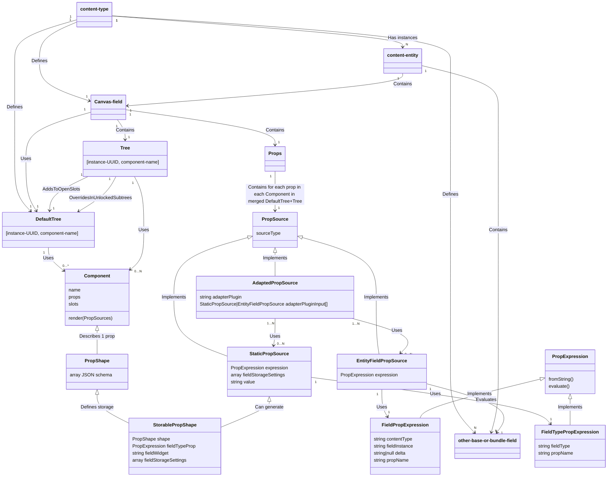

```mermaid
classDiagram
    content-type "1" --> "N" content-entity: Has instances
    content-type "1" --> "1" DefaultTree: Defines
    content-type "1" --> "N" other-base-or-bundle-field: Defines
    content-type "1" --> "1" Canvas-field: Defines
    content-entity "1" --> "1" Canvas-field: Contains
    content-entity "1" --> "N" other-base-or-bundle-field: Contains
    Canvas-field "1" --> "1" DefaultTree : Uses
    Canvas-field "1" --> "1" Tree : Contains
    Canvas-field "1" --> "1" Props : Contains
    Tree "1" --> "1" DefaultTree: AddsToOpenSlots
    Tree "1" --> "1" DefaultTree: OverridesInUnlockedSubtrees
    class Tree {
       [instance-UUID, component-name]
    }
    class DefaultTree {
       [instance-UUID, component-name]
    }
    DefaultTree "1" --> "0…*" Component: Uses
    Tree "1" --> "0…N" Component: Uses
    Props "1" --> "1" PropSource: Contains for each prop in each Component in merged DefaultTree+Tree
    class Component {
        name
        props
        slots
        render(PropSources)
    }
    class PropShape {
        array JSON schema
    }
    Component <|-- PropShape: Describes 1 prop
    class StorablePropShape {
        PropShape shape
        PropExpression fieldTypeProp
        string fieldWidget
        array fieldStorageSettings
    }
    PropShape <|-- StorablePropShape: Defines storage
    StaticPropSource <|-- StorablePropShape: Can generate
    class PropSource {
        sourceType
    }
    PropSource <|-- EntityFieldPropSource: Implements
    PropSource <|-- StaticPropSource: Implements
    PropSource <|-- AdaptedPropSource: Implements
    class EntityFieldPropSource {
        PropExpression expression
    }
    class StaticPropSource {
        PropExpression expression
        array fieldStorageSettings
        string value
    }
    class AdaptedPropSource {
        string adapterPlugin
        StaticPropSource|EntityFieldPropSource adapterPluginInput[]
    }
    EntityFieldPropSource "1" --> "1" FieldPropExpression: Uses
    StaticPropSource "1" --> "1" FieldTypePropExpression: Uses
    EntityFieldPropSource "1" --> "1" other-base-or-bundle-field: Evaluates
    AdaptedPropSource "1…N" --> "0…N" StaticPropSource: Uses
    AdaptedPropSource "1…N" --> "0…N" EntityFieldPropSource: Uses
    PropExpression <|-- FieldTypePropExpression: Implements
    PropExpression <|-- FieldPropExpression: Implements
    class PropExpression {
        fromString()
        evaluate()
    }
    class FieldTypePropExpression {
        string fieldType
        string propName
    }
    class FieldPropExpression {
        string contentType
        string fieldInstance
        string|null delta
        string propName
    }
```
