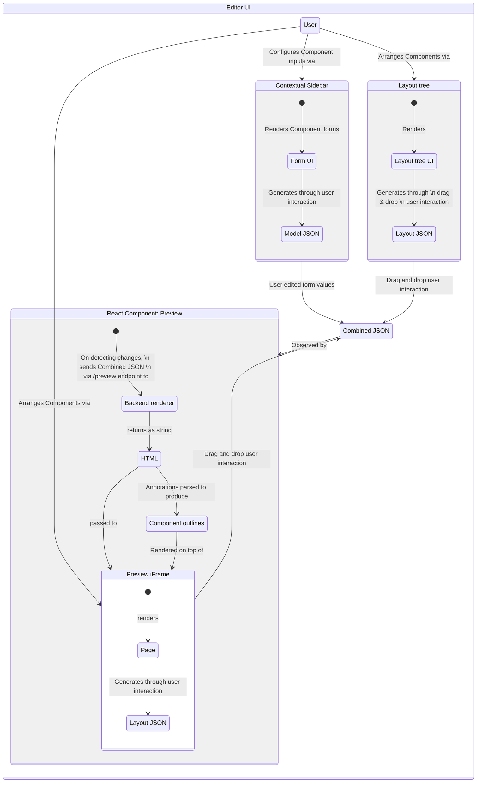

```mermaid
stateDiagram-v2
state "Layout JSON" as json_layout
state "Layout JSON" as json_layout2
state "Model JSON" as json_model
state "Combined JSON" as JSON
state "Backend renderer" as BE
state "Editor UI" as editor
state "Component outlines" as component_ui
state "HTML" as HTML
state "Contextual Sidebar" as sidebar
state "Layout tree" as tree
state "Layout tree UI" as display
state "Form UI" as form_ui
state "Preview iFrame" as preview
state "React Component: Preview " as react_preview


    state editor {
        User --> sidebar : Configures Component inputs via
        User --> tree : Arranges Components via
        User --> preview : Arranges Components via

        sidebar --> JSON: User edited form values
        tree --> JSON : Drag and drop user interaction

        state react_preview {
            [*] --> BE : On detecting changes, \n sends Combined JSON \n via /preview endpoint to
            BE -->HTML : returns as string
            HTML --> component_ui : Annotations parsed to produce
            HTML --> preview : passed to
            component_ui --> preview : Rendered on top of
            preview --> JSON : Drag and drop user interaction

            state preview {
                [*] --> Page : renders
                Page --> json_layout2 : Generates through user interaction
            }
        }

        state tree {
            [*]-->display : Renders
            display-->json_layout : Generates through \n drag & drop \n user interaction
        }

        state sidebar {
            [*] --> form_ui : Renders Component forms
            form_ui --> json_model : Generates through user interaction
        }

        JSON --> react_preview : Observed by

    }

```
