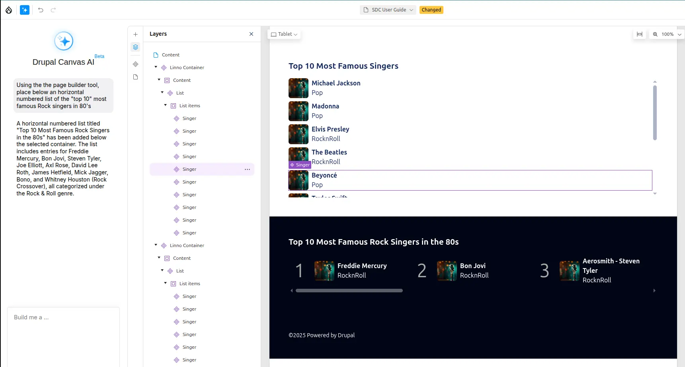
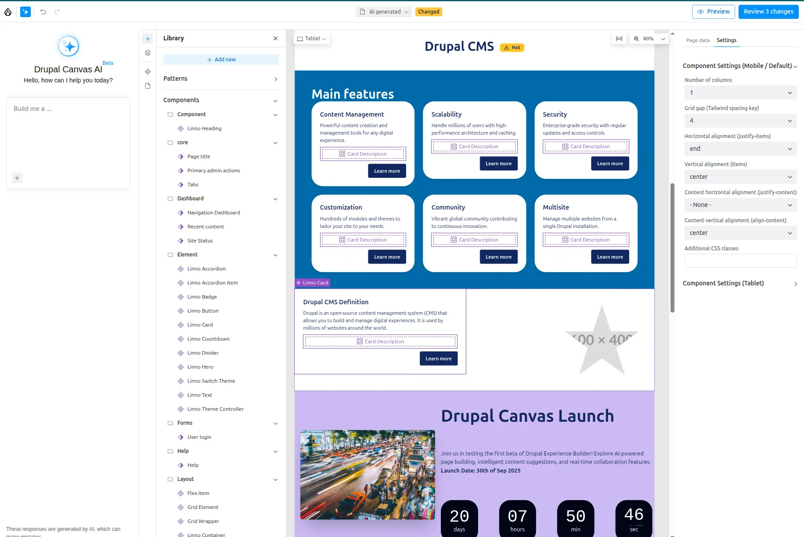
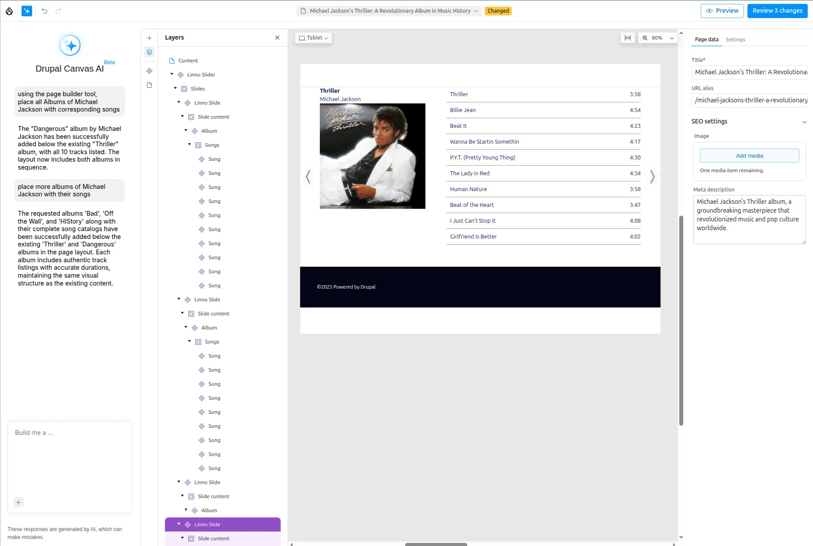
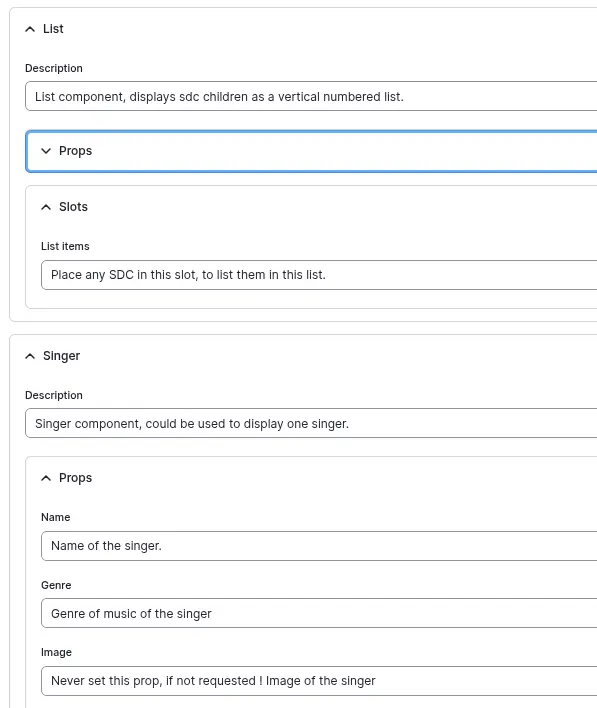
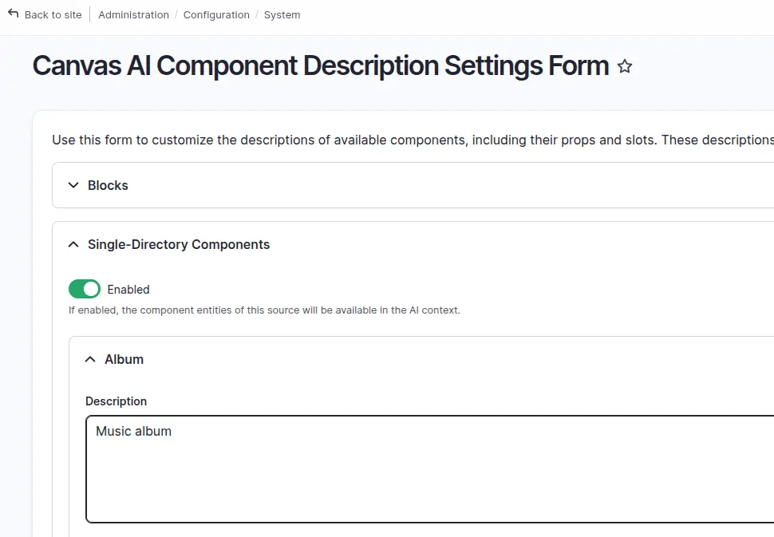

Drupal Canvas features an integrated AI chatbot that streamlines the creation of
Canvas pages. This powerful tool allows you to either **generate new code
components or leverage existing components to create content**.

## Getting Started

**Requirements**:

- Enable the `canvas_ai` submodule.
- Add an `AI provider` that supports `function calling` such as
[OpenAI models](https://www.drupal.org/project/ai_provider_openai)
- Configure your AI provider for all **Chat operation types** in
`admin/config/ai/settings`

Once these steps are complete, a new AI icon ✨ will appear in the Canvas interface,
giving you access to the chatbot.


---
## How it works ?

The `Canvas AI orchestrator` (AI Agent) receives your prompt and determines your
intent. It then redirects the prompt to the appropriate AI agent.

- If you use words like `Place` or `Use`, the orchestrator understands that you
want to use an existing component and directs the prompt to the
`canvas_page_builder_agent`. This agent retrieves all
[enabled components](/sdc-components/troubleshooting#sdc-status) and uses them as context to build
your page.

- ❗ If you use ambiguous words like `Create` or `Add`, the orchestrator may
direct the prompt to another agent `canvas_component_agent` to
create a new code component.

---

## Using the Chatbot

Enough with theory ! Let's practice !

I'm sure you want to know what **prompt** was used to generate the list of
singers, here it is:

>
> 💬 `Place a list of the "top 10" most famous singers.`
>

  **Yes that's it !**

**You can also add more details to your prompt:**

>
> 💬 `Place below an horizontal numbered list of the "top 10" most famous Rock singers in 80's`
>



### Forcing SDC Usage

If you want to ensure the chatbot uses an existing SDC and does not create a new
component, prefix your prompt with a specific phrase.

ℹ️ One way to force the usage of SDC and not to create new code component, is to
precede your prompt by:

> 💬 **Using the page builder tool**, place a hero component at the top of the page.

### Positioning Content

You can control where content is placed on the page by using directional words.

- ℹ️ **Position:** Use words like **at the top**, **at the bottom**, **below**,
**above**.

- ℹ️ **Nesting:** To place a component inside another, select a component on
the canvas and use words like **into**, **inside** in your prompt.

## Generating a Full Page

The `canvas_template_builder_agent` is designed to build entire
pages, headers, and footers. A succession of clear, focused prompts often gives
better results than a single, complex one.

### Example Prompt:

- 💬 `Create a template for the homepage of a pizza shop website`
- 💬 `Create a header template for a pizza shop website`
- 💬 `Create a footer template for a pizza shop website`
- 💬 `Create a template for the homepage of a pizza shop, with proper header and footer`

### With a design system

Drupal CMS will include its own design system; with a library of SDCs, you can
achieve great Result.

**Some idea:**

> 💬  Using the page builder tool,
> place a hero for the next release of Drupal Drupal Canvas first beta,
> - For the text: make an appealing paragraph to incite people to already test
> new features like page building with AI. Specify the released date in
> bold in the Hero text, "31th of July 2025"
> - The background should use accent style
> - In the slot actions: place an existing countdown for the 31th of July
> 2025 at 8:00PM.

**Example of page**:
_Fully AI generated with a **Design System** based on **Tailwind & DaisyUI** 🕶️ !_



But because we love music, let's create more SDC to display our favorite
albums of Michael Jackson with corresponding songs with name and duration, and
let's use AI to help us to fill those new SDCs. And let's insert everything in a
Slider component.


---

## Optimizing Your Components for AI

The quality of your components' descriptions directly impacts the AI's ability
to use them correctly.

### Provide Guidance for Component Usage

Use this form to define clear instructions and contextual information for SDCs,
Blocks, and JS components, including their props and slots.

💡 Describe when and how each component should be used, whether it can stand
alone or must be placed within another component’s slot, suitable values for
each prop, ideal prop combinations, and other usage best practices.



ℹ️ If you want to keep these changes, export your Drupal config:
`canvas_ai.component_description.settings.yml` — it will include your additions.

🚩 Important: It's crucial to accurately and thoroughly describe all your
components, props, and slots.

### Restrictions on Slots

💡 Currently, there are no built-in restrictions on what can be placed into a slot.
To guide the AI, you must explicitly state what a slot is designed to accept
within its description.

```yaml
slots:
  content:
    title: Card Description
    description: >
      The description or body text of the card.
      Don't place buttons or badges here, use the actions slot for that.
  actions:
    title: Actions
    description: The actions of the card, use buttons or badge components here.
```

---
## Limitations and Costs

### Known Issues

- The AI is not deterministic, so the same prompt may yield different results.
- The AI may sometimes return a non-existent value for an `enum` or a component
ID, which can cause a rendering error.
- Prompts may result in incorrect results if the wording is too vague.

### AI Cost

The AI context size can be large—especially if many components, props, and slots
are enabled. This can easily exceed 30,000 tokens, increasing usage costs.

To reduce input tokens, you should:

- Disable unused components.

- Optimize component descriptions.

- Select which component types to include in the context. You can do this
at `Configuration -> AI -> Canvas AI Component Description Settings`.



- 💡 Choose a model from an AI provider with low per-token input costs.
