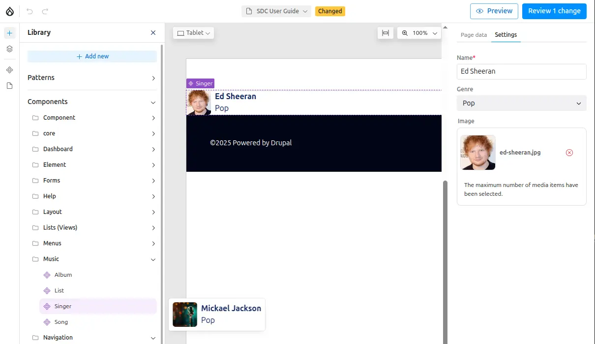

[Single Directory Components (SDC)](https://www.drupal.org/docs/develop/theming-drupal/using-single-directory-components/quickstart)
contain your own Twig, JavaScript, and CSS. They can be provided as part of a
Drupal module or theme and can be reused across your Canvas projects.

Components are built using Drupal's native Twig templating system with optional
JavaScript and CSS files for enhanced functionality and styling.

## Creating a new SDC component

Inside your custom theme, create a folder for your new SDC.
- Inside a `components/` folder, create a `singer/` folder for your new Single
Directory Component.

This directory should contain at least:
- `singer.component.yml` that defines the component metadata (props and slots)
- `singer.twig` that defines the markup

Optionally in the same folder add:
- `singer.css` for styling
- `singer.js` for behaviors
- Extra assets: images, SVG icons, fonts, etc.
- `README.md` file for documentation

Required Drupal libraries should be defined in the `libraryOverrides`
section of the `singer.component.yml` file.

### Structure

```
my_theme/
└── components/
    └── singer/
        ├── singer.component.yml
        ├── singer.twig
        ├── singer.css
        └── micro.jpg
```

### Props

Our SDC defines 3 content props:
- `name` of the singer (string)
- `image` of the artist (image object)
- `genre` of music (predefined string values)

<a href="/sdc-components/props">Further details about props.</a>

### Component metadata

The component metadata is defined in the `.component.yml` file:

```yaml
# singer.component.yml
'$schema': 'https://git.drupalcode.org/project/drupal/-/raw/HEAD/core/assets/schemas/v1/metadata.schema.json'
name: Singer
status: stable
group: Music
description: Singer component, could be used to display one singer.
props:
  type: object
  required:
    - name
  properties:
    name:
      type: string
      title: Name
      description: Name of the singer.
      examples: ['Michael Jackson','Bruno Mars']
    genre:
      type: string
      title: Genre
      description: Main music Genre of the singer
      enum:
        - Pop
        - Jazz
        - Soul
        - Funk
        - "Rock and Roll"
        - Electro
      examples: ['Pop']
    image:
       $ref: json-schema-definitions://canvas.module/image
      type: object
      title: Image
      description: >
        Image of the singer
      examples:
        - src: 'micro.webp'
          alt: 'Nice picture of the singer'
          width: 200
          height: 300
```

You can use this image for the default image of a new Singer


### Twig template

```twig
{# singer.twig #}
<div class="singer">
  
  <div>
    <h3 class="singer-name">{{ name }}</h3>
    <div class="singer-genre">{{ genre }}</div>
  </div>
</div>
```

### Styling

```css
/* singer.css */
.singer {
  display: flex;
  align-items: center;
  gap: 0.5rem;
}
.singer-image {
  height: 50px;  width: 50px;
  object-fit: cover;
  border-radius: 6px;
}
.singer-name { font-weight: bold; }
.singer-genre { font-weight: normal; }
```

## Using the component

Once created, your `Singer` component is ready to be used in Canvas:

1. The component appears in the sidebar under the "Music" group (as defined in metadata)
2. Hovering over the component shows a preview with <a href="/sdc-components/validations#default-values">default prop values</a>.
3. Drag the component to the Canvas and configure its properties



## Creating collections

To display multiple singers, you can use [Slots](/sdc-components/slots) to create container components that accept multiple child components.
