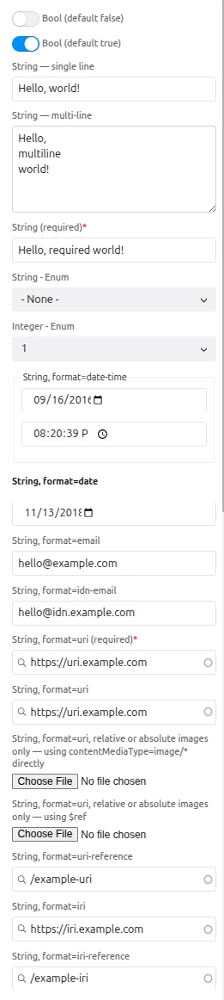
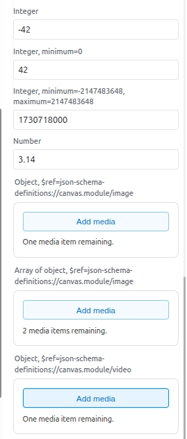
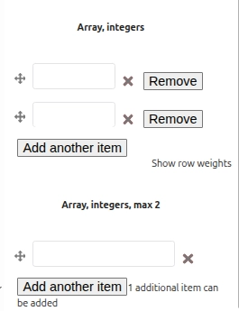
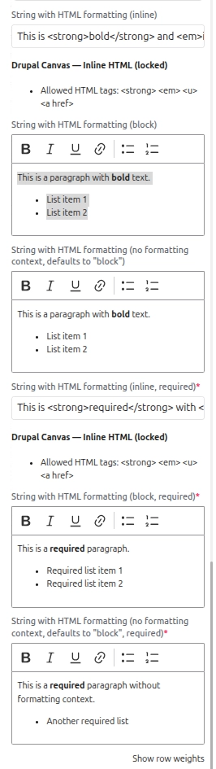

<style>{`
.sl-markdown-content table td {
  vertical-align: top;
}
`}</style>

Props allow SDC components to define configurable inputs that users can configure
in the Canvas interface. Each prop specifies its type, validation rules, and
provides example values.

Props can be used to:

- Insert content (text, images, etc.)
- Configure component appearance (colors, alignment, state)
- Control component behavior (animations, interactions)

Canvas automatically generates a form based on the props.

## Prop types and examples

### String

Basic text input for short text content.

**Schema Definition:**
```yaml
title:
  type: string
  title: 'Component title'
  examples: ['Hello World']
```

**Twig Usage:**
```twig
<h2>{{ title }}</h2>
```

### String with HTML

Rich text editor for formatted content with HTML markup.

**Schema Definition:**
```yaml
content:
  type: string
  title: 'Rich text content'
  contentMediaType: text/html
  x-formatting-context: block
  examples: ['<p>This is <strong>formatted</strong> text</p>']
```

**Twig Usage:**
```twig
<div class="content">
  {{ formatted_content }}
</div>
```


### Textarea

Textarea input for longer text content that spans multiple lines.

**Schema Definition:**
```yaml
description:
  type: string
  title: 'Description'
  $ref: json-schema-definitions://canvas.module/textarea
  examples: ['A longer description\nthat spans multiple lines']
```

**Twig Usage:**
```twig
<div class="description">
  {{ description|nl2br }}
</div>
```


### Boolean

Checkbox input for true/false values.

**Schema Definition:**
```yaml
show_image:
  type: boolean
  title: 'Show image'
  examples: [true]
```

**Twig Usage:**
```twig

  <div class="image-section">...</div>

```

### Integer

Numeric input with optional validation constraints.

**Schema Definition:**
```yaml
spacing:
  type: integer
  title: 'Spacing in pixels'
  minimum: 0
  examples: [20]
```

**Twig Usage:**
```twig
<div style="padding-top: {{ spacing }}px">
  Content with spacing
</div>
```

### Link

URL input for internal or external links. Choose the format based on what you accept:

- **`format: uri`** — Absolute URLs only. The value must include a scheme (e.g. `https://example.com`, `internal:/node/1`). Use when the link must always be a full URI.
- **`format: uri-reference`** — Absolute or relative. The value may be a full URI or a path such as `/about` or `../page.html`. Use when relative paths or mixed link types are allowed.

**Schema Definition (absolute only):**
```yaml
link:
  type: string
  format: uri
  title: 'Link URL'
  examples: ['https://example.com/path']
```

**Schema Definition (absolute or relative):**
```yaml
link:
  type: string
  format: uri-reference
  title: 'Link URL'
  examples: ['/about', 'https://example.com']
```

**Twig Usage:**
```twig
<a href="{{ link }}">Link text</a>
```

### Enum (Dropdown)

Renders as a dropdown with predefined options. Use `meta:enum` to customize display labels:

**Schema Definition:**
```yaml
alignment:
  type: string
  title: 'Text alignment'
  enum: ['left', 'center', 'right']
  meta:enum:
    left: Left aligned
    center: Center aligned
    right: Right aligned
  examples: ['center']
```

**Twig Usage:**
```twig
<h2 class="heading heading--{{ alignment }}">
</h2>
```

### Image Object

Image selection from media library or image upload.

**Schema Definition:**
```yaml
image:
  title: 'Component image'
  $ref: json-schema-definitions://canvas.module/image
  type: object
  examples:
    - src: '/path/to/image.jpg'
      alt: 'Component image'
      width: 800
      height: 600
```

**Twig Usage:**
```twig

```

### Date

Date picker input for selecting dates.

**Schema Definition:**
```yaml
event_date:
  type: string
  format: date
  title: 'Event date'
  examples: ['2024-12-25']
```

**Twig Usage:**
```twig
<time datetime="{{ event_date }}">
  {{ event_date|date('F j, Y') }}
</time>
```

### Array

List input allowing multiple values.

**Schema Definition:**
```yaml
numbers:
  type: array
  title: 'List of numbers'
  items:
    type: string
  maxItems: 10
  examples: [['One', 'Two', 'Three']]
```

**Twig Usage:**
```twig

  <span class="number">{{ number }}</span>

```

## Additional resources

For a comprehensive overview of all available prop types and their widgets,
refer to the **"All-Props" Test SDC** module which demonstrates every supported
prop type with examples.

| Boolean, strings with different formats | Integer, image, video, array of integers | Enriched HTML |
|-----------------------------------------|------------------------------------------|---------------|
|  |   |  |


