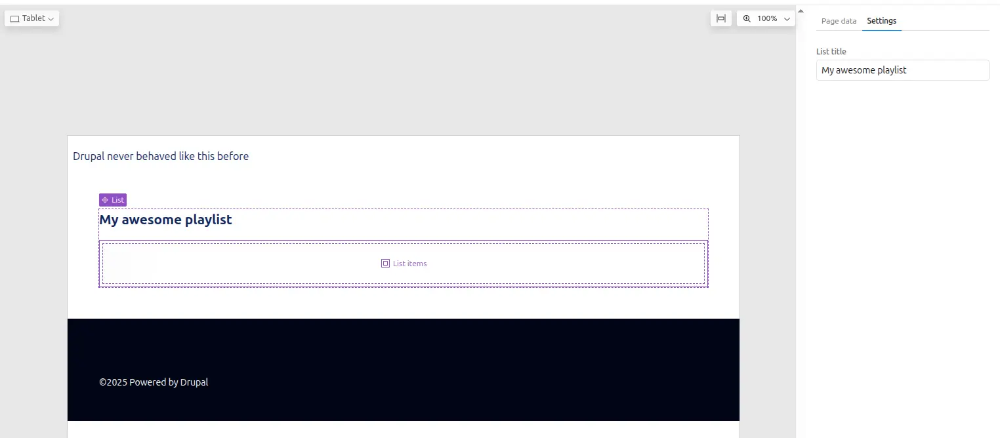
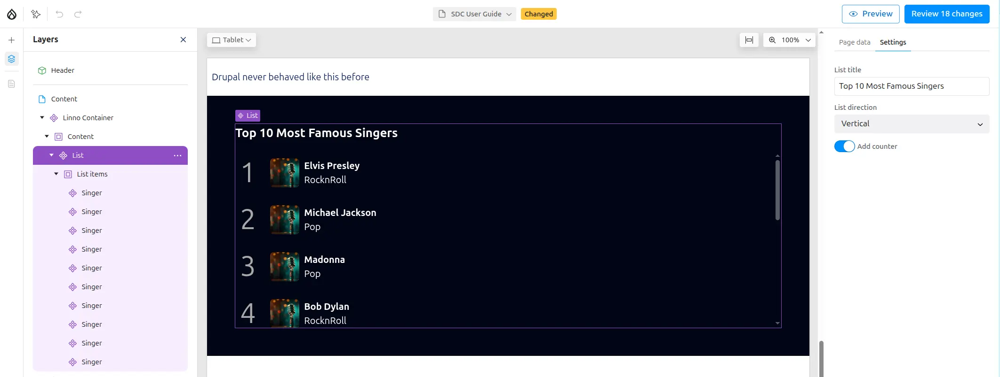
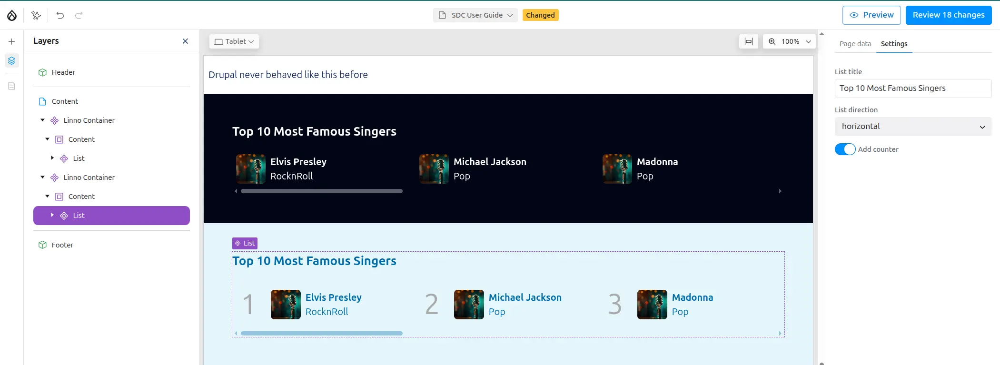

import { FileTree } from '@astrojs/starlight/components';

Slots allow you to place other SDC components, or any other Canvas
component, inside your component. They define regions where content can be
dynamically inserted.

For example, a `List` component can define a slot called `Items` that accepts
any other SDC component to display as list items.

## Creating components with slots

Let's create a list component to display multiple artists. This component will
act as a container where you can add multiple `Singer` components.

<FileTree>
- my_theme
  - components
    - list
      - list.component.yml
      - list.twig
      - list.css
</FileTree>

### Component structure

- A **prop** `title` to show the name of the list
- A **slot** `content` to contain the list items

To define a slot, add it under the `slots` key in your component metadata. You can define multiple slots.

This `List` component is generic and can contain any type of component, not just Singers.

### Component metadata

The `List` component defines one prop and one slot:

```yaml
# list.component.yml
'$schema': 'https://git.drupalcode.org/project/drupal/-/raw/HEAD/core/assets/schemas/v1/metadata.schema.json'
name: List
status: stable
group: Music
description: List component, displays sdc children as a vertical numbered list.
props:
  type: object
  properties:
    title:
      type: string
      title: List title
      description: >
        Title of the list
      examples: ["My awesome list"]
slots:
  content:
    title: List items
    description: >
      Place any SDC in this slot, to add them to the list.
```

The `title` key of each slot is used as the placeholder text in Canvas.



### Twig template

The template should use unique classes for each section to facilitate styling.
Using BEM methodology is recommended to avoid CSS collisions:

```twig
{# list.twig #}
<div class="sdc-list">
  <h2 class="list-title">{{ title }}</h2>
  <div class="list-items {{ classes }}">
    {{ content }}
  </div>
</div>
```

### Styling

Let's add some CSS:

- The list will be vertical
- An automatic scrollbar when many items

```css
/* list.css */
.list-title {
  font-size: 1.3rem;
  font-weight: 700;
  margin-block-end: 1rem;
}

.list-items {
  display: flex;
  gap: .5rem;
  counter-reset: list-number;
  flex-direction: column;
  max-block-size: 300px;
  overflow-y: auto;
  & > *:hover {
    background-color: lightgrey;;
  }
}
```

## Enhanced list component

Let's enhance the list component by adding props to control its appearance:

- Display the list horizontally or vertically
- Display an optional Counter

```yaml
# list.component.yml
...
direction:
  type: string
  title: List direction
  enum: ['vertical','horizontal']
  meta:enum:
    vertical: Vertical
    horizontal: horizontal
  examples: ['vertical']
with_counter:
  type: boolean
  title: Add counter
  description: Add a number to each list item
  examples: [false]
```

Here is one way to add multiple css classes according prop values:

```twig
{# list.twig #}


<div class="sdc-list">
  <h2 class="list-title">{{ title }}</h2>
  <div class="list-items {{ classes }}">
    {{ content }}
  </div>
</div>
```

And let's add more CSS for our new props

```css
/* list.css */
...
.list-direction-horizontal {
  flex-direction: row;
  overflow-x: auto;

  &>* {
    flex-shrink: 0;
    flex-basis: 300px;
    padding: 6px;
  }
}
.list-with-counter >* {
  counter-increment: list-number;
  &:before {
    font-size: 3rem;
    color: darkgrey;
    content: counter(list-number);
    padding-inline: .5rem;
    margin-inline-end: .5rem;
  }
}
```

## Using the enhanced list

Your enhanced `List` component is now ready to display multiple items in various layouts:



The component supports horizontal and vertical layouts, with optional counters:



To learn about integrating AI capabilities with Canvas, see [Canvas with AI](/ai-assistant).
