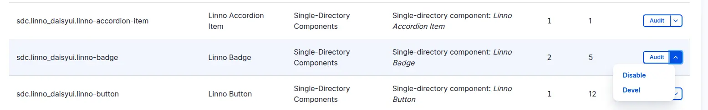

## SDC is not appearing in Library panel

If your SDCs aren't appearing in the `Library panel` of Drupal Canvas,
you'll need to verify their status. Follow these steps:

1.  **Confirm Listing in Components Tab:**
    Navigate to the **Components** tab on the **Appearance** page, typically
    found at `/admin/appearance/component`. Ensure your SDCs are listed there.

    

2.  **Verify Enabled Status:**
    On the same page (`/admin/appearance/component`), check that your SDCs are
    explicitly marked as **Enabled** and not **Disabled**.

    

3.  **Investigate Disabled SDCs:**
    If an SDC is not enabled, visit `/admin/appearance/component/status` for a
    detailed explanation of why it's disabled or invalid. This page will provide
    crucial information for troubleshooting.

    
