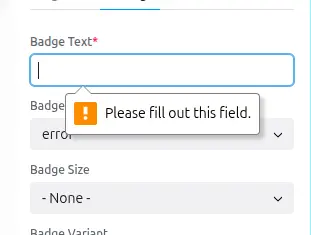

## Required props

If a prop is required, it will be marked as such in the sidebar, and saving the
page will not be possible until the required prop is filled.



List all required props under the key: `required`.

```yaml
props:
  type: object
  required:
    - text
  text:
    type: string
    examples:
      - "Hot"
```

## Default values

To set default value use the `examples` property, you can set multiple
examples, but only the first one will be used as the default value.
(useful to show developers how this prop could be used)


```yaml
props:
  type: object
  text:
    type: string
    examples:
      - "Hot"
      - "New"
    description: "The text displayed in the badge."
```
- ⚠️ pay attention `examples` **is an array**, not just a string or a number.
- ⚠️ When a prop is required, `examples` is **mandatory**.
- Default values will be used when the component is first added to the page.

## Validations

According `prop types` and `format`used, Canvas already adds default validations
for the props values.

For example:
- `format: email` will guarantee the entered value is a valid email address,
- `format: date-time` will ensure the value is a valid date and time, etc.

In addition, you can add other validations like:
- `minLength`, `maxLength` for `string` props,
- `minItems`, `maxItems` for `array` props,
- `minimum`, `maximum` for `number` props,
- ...

```yml
  test_integer_range_minimum:
    title: 'Integer, minimum=0'
    type: integer
    minimum: 0
```


